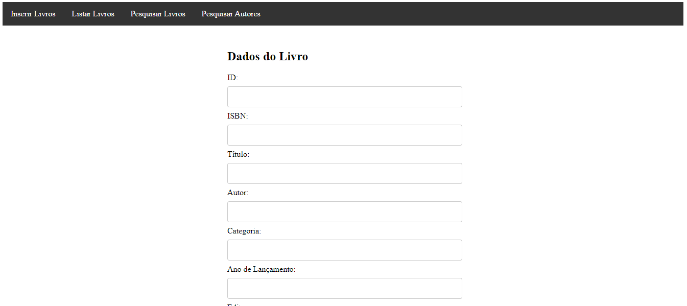

<h1 align="center"> 
  GAMES INFO WEBSITE 
</h1>

 This website was built back in 2018 high school when I was in the IT course in Lisbon. 

  

## 📑 ABOUT THE WEBSITE
This simple project was my third website. Such as the school-project-1 website, this one had no purpose besides testing my knowledge so the looks is not that good tho.
The purpose of this website was to make an web library without user/admin registration. So basically, here we were testing our PHP knowledge. 

The website was built with 4 pages. Inserir Livros, Listar Livros, Pesquisar Livros, Pesquisar Autores.  
- The Inserir Livros page has the purpose of adding books to the database of the website.  
- The Listar Livros page has the purpose of listing all the books added on the database.  
- The Pesquisar Livros and Pesquisar Autores pages has the purpose of searching for the books/authors of the books and listing it when found.

## 👩‍💻 USED TECHNOLOGIES
On this website I worked with:  
- HTML5.
- CSS3.
- Javascript.
- PHP & Mysql (using XAMPP)

## 📌 POSSIBLE UPGRADES
I'm uploading this project on github because I think this is something I can work on to improve and practice my habilities so, possibly in my free times I'll be doing some updates on this website without changing it's original objective.

## 💁‍♀️ AUTHOR
<table>
  <tr>
    <td align="center">
      <a href="https://github.com/laragraysse">
         
        
          <b>Lara Graysse</b>
        
      </a>
    </td>
  </tr>
</table>
